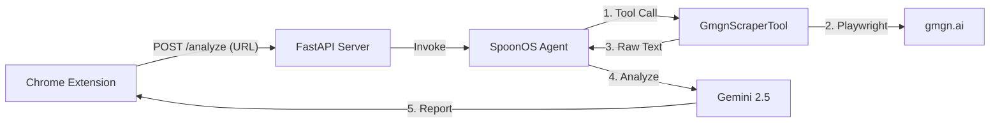

# 📘 SpoonOS GMGN Analyst - Implementation Notes

**Version**: 2.0 (Chrome Extension Edition)
**Date**: 2026-01-31
**Stack**: Python 3.12, FastAPI, Playwright, Chrome SidePanel, SpoonOS SDK

## 1. Project Overview

This project implements an AI-powered crypto analyst agent that integrates directly into the browser.
Instead of copy-pasting addresses into a CLI, users open a sidebar while browsing [GMGN.ai](https://gmgn.ai) to get instant fundamental analysis.

## 2. Technical Architecture

### 2.1 The "Sidecar" Pattern

We use a "Browser + Local Server" architecture:

1.  **Browser (Frontend)**: A standard Chrome Extension using the SidePanel API. It handles user interaction, grabs the current tab's URL, and renders the Markdown result.
2.  **Local Server (Backend)**: A `FastAPI` server wrapping the **SpoonOS Agent**. It keeps the heavy Python logic (Playwright, LLM context) running locally, avoiding the limitations of browser-based JS environments.

### 2.2 Key Components

#### A. The Extension (`extension/`)
-   **Manifest V3**: Requests `sidePanel` and `tabs` permissions.
-   **`sidepanel.js`**: Logic to query the `lastFocusedWindow` (critical for side panels) and detect `gmgn.ai` URLs. It fetches available Gemini models from the server dynamically.
-   **`marked.min.js`**: Renders the AI's Markdown response into rich HTML (bold, lists, etc.).

#### B. The Server (`server.py`)
-   **Framework**: FastAPI with CORS enabled (to allow calls from `chrome-extension://`).
-   **Prompt Engineering**:
    -   **Context Injection**: Injects `datetime.now()` so the LLM knows the current date (prevents "future date" hallucinations).
    -   **Structure Enforcement**: Forces the LLM to output "Investment Recommendation" first.
-   **Direct URL Support**: Tells the agent it can pass full URLs to the tool.

#### C. The Tool (`gmgn_scraper.py`)
-   **Hybrid Input Mode**:
    -   **Direct URL**: If input starts with `http`, it navigates directly (faster, supports all chains).
    -   **Address + Chain**: Original logic to construct URLs for specific chains (SOL, BSC, ETH, TRON).
-   **Anti-Bot**: Uses `Playwright` with `user_agent` spoofing and waits for `domcontentloaded` + 5s delay to handle React hydration.

## 3. Development Workflow

### Adding a New Chain
1.  **Scraper**: No change needed if utilizing Direct URL mode. For Address mode, update regex in `gmgn_scraper.py`.
2.  **server**: No change needed.

### Modifying the Prompt
Edit `server.py` -> `system_prompt`.
Changes take effect immediately after restarting `uv run server.py`.

### Updating the Extension
1.  Edit `extension/*.html` or `*.js`.
2.  Go to `chrome://extensions`.
3.  Click **Reload** on the extension card.

## 4. Current Limitations & Roadmap

-   **Auth**: Currently uses a raw API Key stored in `localStorage`.
-   **Session**: Each analysis is stateless. Future versions could support "Chat with Page" by maintaining thread history.
-   **Scraping**: Relies on DOM text. If GMGN changes class names significantly, text extraction usually survives, but layout parsing might fail.

---
*Reference for Developer Handoff*